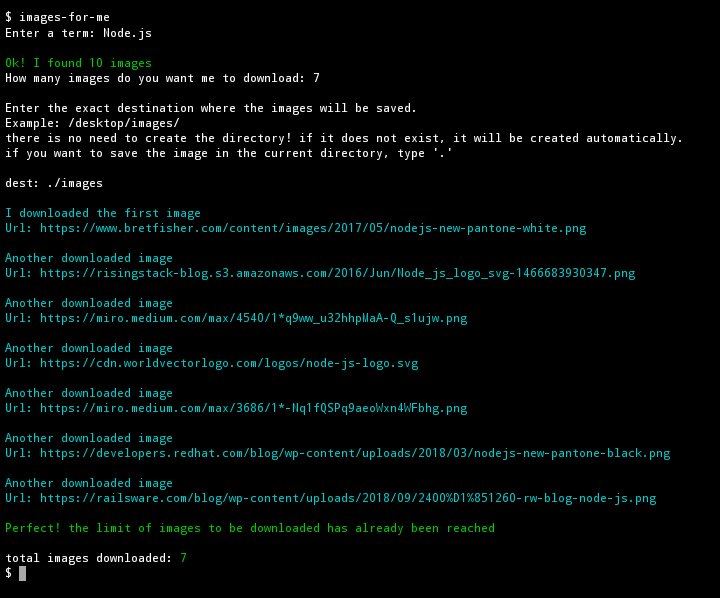
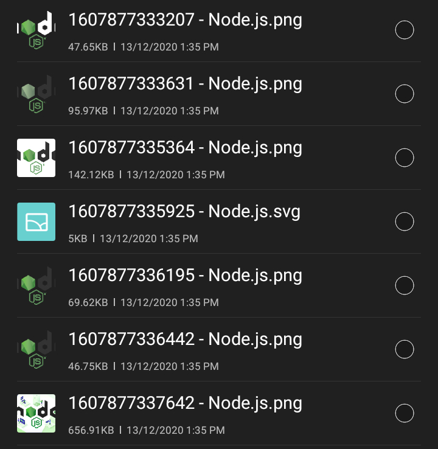

# images-for-me

a robot that downloads images, and all it takes is a term and destination to save the images.

### installation

```sh 
$ npm i -g images-for-me
```

<p style="background:yellow; margin:30px; padding:10px; border-radius:10px;">Note: the '-g' is essential for you to run the robot in any folder or project.  Otherwise, you will not be able to use the robot.<p>

------

### Example of use



in the example above, it will download the 7 images into the 'images' folder which is located in the current directory.


folder where the robot downloaded the images:



<p style="background:yellow; margin:30px; padding:10px; border-radius:10px;">Note: in the field dest enter the exact destination where the images will be saved.

Example: /desktop/images/

there is no need to create the directory! if it does not exist, it will be created automatically.

if you want to save the image in the current directory, type '.'<p>
